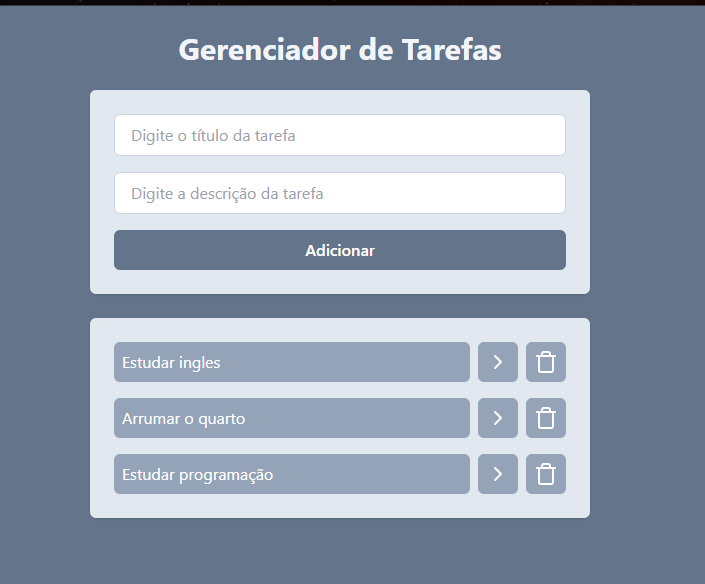

# 🚀 Gerenciador de Tarefas com React

Este projeto foi desenvolvido com o objetivo de praticar e aprimorar meus conhecimentos em React.

📚 Projeto criado durante meus estudos no curso da Full Stack Club, com foco em desenvolvimento full stack.

---

## 🧠 Objetivo

O principal objetivo deste projeto é colocar em prática conceitos importantes do React, como:

- Componentização
- Manipulação de estado
- Renderização dinâmica
- Organização de código
- Boas práticas de desenvolvimento

---

## ⚙️ Funcionalidades

- ✅ Adicionar tarefas
- 📝 Editar tarefas
- ❌ Remover tarefas
- 📋 Listar tarefas
- 🔄 Atualização dinâmica da interface

---

## 🛠️ Tecnologias utilizadas

- React
- JavaScript
- HTML5
- Tailwind CSS

---

## 📸 Preview




---

## ▶️ Como rodar o projeto

```bash
# Clone o repositório
git clone https://github.com/RafaelmbSena/Gerenciador-de-tarefas-com-React.git

# Acesse a pasta
cd Gerenciador-de-tarefas-com-React

# Instale as dependências
npm install

# Execute o projeto
npm run dev